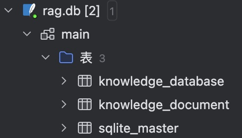
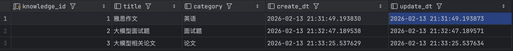
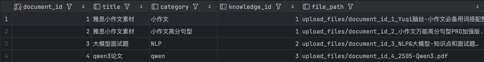
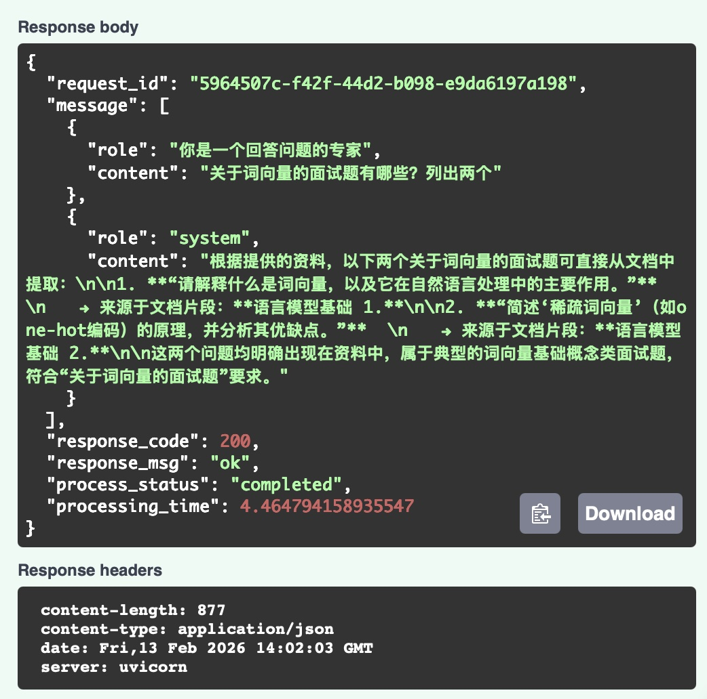

# RAG 检索增强生成系统

## 项目简介

本项目是一个基于 FastAPI + Elasticsearch + 大语言模型 实现的检索增强生成（RAG）系统，支持知识库管理、文档上传解析、语义检索、多轮对话等核心功能。用户可上传 PDF 等文档构建知识库，通过自然语言提问获取基于知识库内容的回答。

## 核心特性

1. **知识库管理**：支持知识库的新增、查询、删除，按分类管理文档；
2. **文档处理**：支持文档的新增、查询、删除，且上传 PDF 文档可以自动解析、文本分块、语义向量化，并存入 Elasticsearch；
3. **混合检索**：结合 BM25 关键词检索 + 向量余弦相似度检索，RRF 融合排序提升召回率；
4. **多轮对话**：支持基于知识库的多轮上下文对话，可限制历史消息长度；
5. **异步处理**：文档解析 / 向量化异步执行，接口快速响应，不阻塞用户操作；
6. **标准化接口**：基于 FastAPI 提供 RESTful API，请求 / 响应格式严格校验。

## 项目结构

```
03-advanced-rag/
├── test/                    # 测试
│   ├── test_api.py          # 自动化验证RAG的API接口
│   ├── test_db.py           # 验证数据库操作逻辑
│   ├── test_es.py           # 验证RAG与Elasticsearch的交互
│   └── test_rag.py          # 验证RAG流程中的关键步骤
├── config.yaml              # 配置参数
├── db_api.py                # 定义知识库和文档的表结构
├── es_api.py                # 存储文档元数据和向量的索引结构
├── rag_api.py               # RAG核心实现
├── router_schema.py         # 请求/响应数据结构定义
├── main.py                  # FastAPI接口服务入口
└── README.md                # 项目说明
```

## 启动后端服务

```
python main.py
```

启动服务后，访问 `http://localhost:8000/docs` 可查看自动生成的 Swagger 接口文档，支持在线调试。

## 核心流程

#### 步骤 1：创建知识库

```json
POST /v1/knowledge_base
Content-Type: application/json

{
  "category": "技术文档",
  "title": "Python 编程指南"
}
```

响应示例：

```json
{
  "request_id": "xxx",
  "knowledge_id": 1,
  "category": "技术文档",
  "title": "Python 编程指南",
  "response_code": 200,
  "response_msg": "知识库插入成功",
  "process_status": "completed",
  "processing_time": 0.05
}
```

#### 步骤 2：上传文档到知识库

```json
POST /v1/document
Content-Type: multipart/form-data

{
  "knowledge_id": 1
  "title": Python基础语法
  "category": 基础教程
  "file": [选择本地 PDF 文件]
}
```

响应示例：

```json
{
  "request_id": "xxx",
  "document_id": 1,
  "category": "基础教程",
  "title": "Python基础语法",
  "knowledge_id": 1,
  "file_type": "application/pdf",
  "response_code": 200,
  "response_msg": "文档添加成功",
  "process_status": "completed",
  "processing_time": 0.2
}
```

> 注：文档会在后台异步解析、分块、向量化，存入 Elasticsearch，不影响用户的后续操作

#### 步骤 3：RAG 聊天

```json
POST /chat
Content-Type: application/json

{
  "knowledge_id": 1,
  "message": [
    {"role": "user", "content": "Python 中的列表推导式怎么用？"}
  ]
}
```

响应示例：

```json
{
  "request_id": "xxx",
  "message": [
    {"role": "user", "content": "Python 中的列表推导式怎么用？"},
    {"role": "system", "content": "Python 列表推导式..."}
  ],
  "response_code": 200,
  "response_msg": "ok",
  "process_status": "completed",
  "processing_time": 1.2
}
```

#### 步骤 4：多轮对话

继续提问时，需传入完整的历史消息列表：

```json
POST /chat
Content-Type: application/json

{
  "knowledge_id": 1,
  "message": [
    {"role": "user", "content": "Python 中的列表推导式怎么用？"},
    {"role": "system", "content": "Python 列表推导式是..."},
    {"role": "user", "content": "它和普通循环相比有什么优势？"}
  ]
}
```

## 核心接口说明

|       接口路径       | 请求方法 |    功能    |              核心参数               |
| :------------------: | :------: | :--------: | :---------------------------------: |
| `/v1/knowledge_base` |   GET    | 查询知识库 |         knowledge_id、token         |
| `/v1/knowledge_base` |   POST   | 新增知识库 |           category、title           |
| `/v1/knowledge_base` |  DELETE  | 删除知识库 |         knowledge_id、token         |
|    `/v1/document`    |   GET    |  查询文档  |         document_id、token          |
|    `/v1/document`    |   POST   |  上传文档  | knowledge_id、title、category、file |
|    `/v1/document`    |  DELETE  |  删除文档  |         document_id、token          |
|       `/chat`        |   POST   |  RAG 聊天  |        knowledge_id、message        |

## 项目可用性验证 

### 1. 知识库与文档上传验证

数据库结构：



知识库：



文档库：



### 2. 核心功能测试结果 

测试场景：基于上传的「大模型面试题」文档进行 RAG 问答 



- **测试请求**（调用 `/chat` 接口）：  

  ```json
    {
      "knowledge_id": 2,
      "knowledge_title": "大模型面试题",
      "message": [
        {
          "role": "user",
          "content": "关于词向量的面试题有哪些？列出两个"
        }
      ]
    }
  ```

- 测试响应（接口返回结果）

  ```json
  {
    "request_id": "5964507c-f42f-44d2-b098-e9da6197a198",
    "message": [
      {
        "role": "你是一个回答问题的专家",
        "content": "关于词向量的面试题有哪些？列出两个"
      },
      {
        "role": "system",
        "content": "根据提供的资料，以下两个关于词向量的面试题可直接从文档中提取：\n\n1. **“请解释什么是词向量，以及它在自然语言处理中的主要作用。”**  \n　　→ 来源于文档片段：**语言模型基础 1.**\n\n2. **“简述‘稀疏词向量’（如one-hot编码）的原理，并分析其优缺点。”**  \n　　→ 来源于文档片段：**语言模型基础 2.**\n\n这两个问题均明确出现在资料中，属于典型的词向量基础概念类面试题，符合“关于词向量的面试题”要求。"
      }
    ],
    "response_code": 200,
    "response_msg": "ok",
    "process_status": "completed",
    "processing_time": 4.464794158935547
  }
  ```

### 2. 可用性结论

1. 数据来源可验证，回答中明确标注 **来源于文档片段**，证明响应内容完全来自用户上传的知识库文档，而非大模型的通用知识；
2. 该项目完整实现了「知识库管理 → 文档上传 → 异步分块 / 向量生成 → ES 检索 → RAG 问答」全流程；
3. 单次问答处理耗时约 4.46 秒（含 ES 检索 + 大模型生成），满足中小规模知识库的使用需求；
4. 该项目可直接部署为企业级知识库问答系统，支持多知识库隔离、文档异步处理、回答来源追溯，满足中小企业的知识库管理需求

## 优化

针对 RAG 问答做了两个优化：**```query_parse``` 查询解析** 和 **```query_rewrite``` 查询重写**

- ```query_parse``` 查询解析：对于用户的提问先调用 LLM 进行意图识别和关键词的提取，能够在 RAG 问答时让模型更容易理解用户提问，从而给出更加精准的答案。如果关键词提取失败，有 jieba 分词并删除助词等进行兜底操作，该操作可由用户选择是否使用；
- ```query_rewrite``` 查询重写：对于用户提问过于模糊的情况，调用 LLM 并传入相关知识库的主题，让模型对用户提问进行修改，让提问更加准确。
