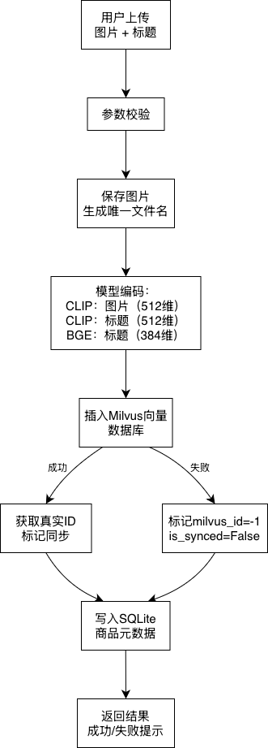
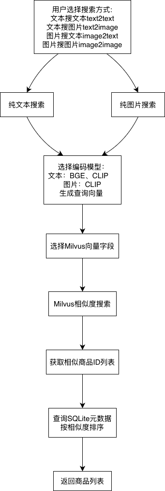

# 多模态商品管理系统

## 项目概述

一款基于 `FastAPI` + `Streamlit` 实现的多模态商品管理系统，支持商品 CRUD、图片上传、跨模态文本检索商品等核心功能。

### 项目核心功能

- 服务健康检查：验证后端服务是否正常运行

- 商品 CRUD 操作：创建、查询商品，支持商品图片上传与本地保存

- 跨模态商品检索：输入文本，通过向量匹配检索相似商品（预留 Clip 模型集成接口）

- 图片自动持久化：上传 / 生成的商品图片自动保存到本地静态目录，避免丢失

## 项目结构

```
05-product-search-matching/
├── tests/                    # 测试
│   ├── 01_test_crud.py        # CRUD接口测试
│   ├── 02_test_search.py      # 创建、检索等接口测试
│   └── 03_批量导入.py          # 导入图片及标题
├── config.py                 # 配置参数
├── data_models.py            # 请求/响应数据结构定义
├── orm_models.py             # 定义关系型数据库的表结构和数据模型
├── vector_db.py              # 实现向量的插入、检索、删除等功能
├── nlp_models.py             # 加载多模态模型，将文本/图片转换成特征向量
├── main.py                   # FastAPI接口服务入口
├── web_demo.py               # 前端页面
├── pages/                    # 功能页面
│   ├── 1_Health_Check.py      # 健康检查
│   ├── 2_Product_List.py      # 商品列表
│   ├── 3_Create_Product.py    # 创建新商品
│   ├── 4_Get_Product.py       # 获取单个商品
│   ├── 5_Delete_Product.py    # 删除商品
│   ├── 6_Update_Product.py    # 更新商品信息
│   └── 7_Search_Product.py    # 检索
└── README.md                 # 项目说明
```

## 核心流程

### 服务启动

#### 1. 启动后端 FastAPI 服务

在项目根目录执行以下命令，启动后端接口服务：

```
uvicorn main:app --reload
```

- 启动成功后，可通过浏览器访问 `http://127.0.0.1:8000` 查看后端服务状态
- 接口文档自动生成：访问 `http://127.0.0.1:8000/docs` 可查看所有接口详情并在线测试

#### 2. 启动前端 Streamlit 页面

打开新的终端（保持后端服务运行，不要关闭），进入项目根目录，激活虚拟环境（若已创建），执行以下命令启动前端：

```
streamlit run web_demo.py
```

- 启动成功后，会自动打开浏览器，进入系统前端主页
- 若未自动打开，可手动访问 `http://localhost:8501`

#### 3. 验证项目运行

1. 在前端左侧导航栏点击「1 Health Check」
2. 点击「运行健康检查」按钮
3. 若显示「✅ 服务运行正常 (Status: 200 OK)」，说明项目前后端通信正常，可正常使用其他功能

### 业务流程

#### 商品写入流程



#### 跨模态检索流程



## 核心功能使用指南

### 1. 商品创建与图片上传

1. 左侧导航栏点击「Create Product」
2. 输入商品标题（如「黑色连帽卫衣」）
3. 点击「上传商品图片」，选择本地一张图片（支持 png/jpg/jpeg）
4. 点击「创建商品」按钮
5. 提示创建成功后，可点击「Product List」查看已创建的商品

### 2. 商品列表查询

1. 左侧导航栏点击「Product List」
2. 页面会自动展示所有已创建的商品，包括商品 ID、标题、图片路径
3. 可刷新页面更新最新的商品列表

### 3. 删除商品

1. 左侧导航栏点击「Delete Product」
2. 输入要删除的商品 ID
3. 勾选「我确认要删除此商品」
4. 点击「执行删除」按钮即可删除

### 4. 更新商品信息

1. 左侧导航栏点击「Update Product」
2. 输入要更新的商品 ID
3. 有两个选择，一个是更新商品标题，一个是更新商品图片
4. 想要更新商品标题输入新标题即可，点击「更新标题」按钮即可
5. 想要更新商品图片上传新图片即可，点击「更新图片」按钮即可

### 5. 搜索商品

1. 左侧导航栏点击「Search Product」
2. 有四种检索类型：文搜文、文搜图、图搜文、图搜图，按需勾选
3. 如果是文搜文或文搜图，输入相应查询文本
4. 如果是图搜文或图搜图，上传相应图片
5. 可以选择返回结果的数量
6. 点击「执行检索」按钮即可进行检索

## 性能测试

#### 测试方法

使用 Locust - Python 负载测试工具，模拟 50 真实用户并发请求

```
# 运行压测
locust -f locustfile.py --host=http://localhost:8000 -u 50 -r 10 --run-time 60s --headless
```

#### 三轮压测对比

| 轮次 | 测试条件                 | 平均延迟 | P95     | 吞吐量   | 总请求 | 关键特征                     |
| ---- | ------------------------ | -------- | ------- | -------- | ------ | ---------------------------- |
| 1    | 50并发，同步阻塞，固定词 | 1679 ms  | 2000 ms | 1.7 QPS  | 62     | 模型推理阻塞主线程，排队严重 |
| 2    | 50并发，线程池，固定词   | 2 ms     | 6 ms    | 24.5 QPS | 1470   | 请求复用，缓存幻觉           |
| 3    | 50并发，线程池，随机词   | 793 ms   | 1100 ms | 44 QPS   | 2636   | 真实性能，最优结果           |

> 固定词导致请求复用，2ms为缓存幻觉；随机词强制走模型推理，793ms为真实性能

#### 优化效果

| 指标         | 优化前     | 优化后     | 提升  |
| ------------ | ---------- | ---------- | ----- |
| 平均响应时间 | 1679ms     | 793 ms     | 2.1x  |
| P95 延迟     | 2000ms     | 1100 ms    | 1.8x  |
| 吞吐量 (QPS) | 1.7        | 44         | 25.9x |
| 错误率       | 0%         | 0%         | 稳定  |
| 并发处理能力 | 单用户阻塞 | 50用户流畅 |       |

用 `ThreadPoolExecutor` 将 CPU 密集型模型推理从主线程解耦，避免阻塞事件循环。
