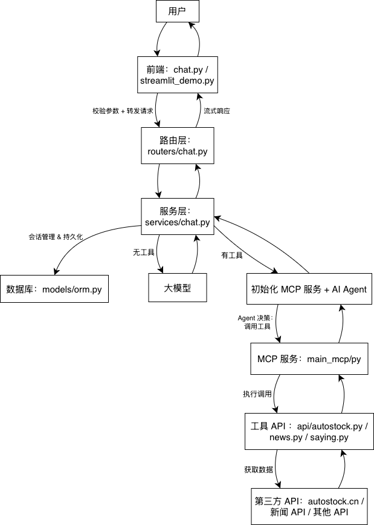
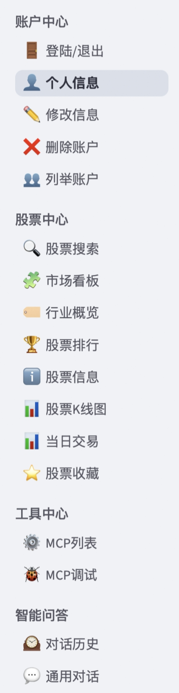

# 智能问答 + 工具调用系统

## 项目概述

本项目是一套基于 **FastAPI + Streamlit + AI Agent + MCP** 构建的智能问答系统，支持**通用对话、股票分析、新闻查询**等场景，核心特性包括：

- 流式响应：AI 回复实时推送；
- 工具调用：Agent 智能决策调用股票 / 新闻等工具，返回结构化数据；
- 会话管理：支持多轮对话、历史记录查询 / 删除、消息反馈；
- 多场景适配：针对股票分析 / 数据 BI 定制化 AI 提示词，保证回复专业性。

## 项目结构

```
06-stock-bi-agent/
├── demo/                         # 前端
│   ├── streamlit_demo.py          # 前端页面
│   ├── chat/                      # 聊天功能
│   │   ├── chat.py                 # 聊天主程序
│   │   ├── chat_list.py            # 聊天列表管理
│   ├── stock/                     # 股票功能
│   │   ├── stock_info.py           # 股票信息
│   │   ├── stock_kline.py          # K线图数据
│   │   ├── stock_search.py         # 股票搜索
│   │   ├── stock_rank.py           # 股票排名
│   │   ├── stock_board.py          # 板块数据
│   │   ├── stock_industry.py       # 行业数据
│   │   ├── stock_favorite.py       # 收藏功能
│   │   ├── stock_min_data.py       # 分钟数据
│   ├── user/                      # 用户管理
│   │   ├── user_login.py           # 用户登录
│   │   ├── user_register.py        # 用户注册
│   │   ├── user_info.py            # 用户信息
│   │   ├── user_list.py            # 用户列表
│   │   ├── user_delete.py          # 用户删除
│   │   ├── user_reset.py           # 密码重置
│   ├── mcp/                       # MCP协议
│   │   ├── mcp_list.py             # MCP列表
│   │   └── mcp_debug.py            # MCP调试
├── routers/                      # FastAPI路由
│   ├── chat.py                    # 聊天路由
│   ├── stock.py                   # 股票数据路由
│   └── user.py                    # 用户管理路由
├── services/                     # 业务服务层
│   ├── chat.py                    # 聊天服务
│   ├── stock.py                   # 股票服务
│   └── user.py                    # 股票服务
├── api/                          # API接口模块（底层api、外部api）
│   ├── autostock.py               # 股票数据接口
│   ├── news.py                    # 新闻数据接口
│   ├── saying.py                  # 名言/语录接口
│   └── tool.py                    # 工具类接口
├── model/                        # 数据模型
│   ├── data_models.py             # 数据模型定义
│   └── orm.py                     # 关系型数据库关系映射
├── test/                         # 单元测试文件
│   ├── test_agent.py              # 代理测试
│   ├── test_autostock.py          # 自动化股票测试
│   ├── test_jinja2_template.py    # 模板测试
│   └── test_mcp.py                # MCP协议测试
├── templates/                    # 模板文件
│   └── chat_start_system_prompt.jinjia2    # 聊天系统提示模板（Jinja2格式）
├── main_mcp.py                   # MCP Server 主程序
├── main_server.py                # Fast API Web服务主程序
└── README.md                     # 项目说明
```

## 核心流程

### 1. 服务启动

#### 步骤 1：启动 MCP 工具服务

运行

```
python main_mcp.py
```

- 注册股票 / 新闻等工具，启动 MCP 服务（端口：8900，协议：SSE）；
- 验证工具注册结果，输出 “Available tools” 列表。

#### 步骤 2：启动 FastAPI 主服务

运行

```
python main_server.py
```

- 挂载路由层 / 工具 API，启动 HTTP 服务（端口：8000，协议：HTTP + SSE）；
- 自动生成 API 文档：`http://localhost:8000/docs`。

#### 步骤 3：启动前端交互页面

运行

```
streamlit run demo/streamlit_demo.py
```

- 打开浏览器访问 `http://localhost:8501`，进入智能问答界面。

### 2. 业务流程

用户通过前端发起请求 → 路由层校验并转发 → 服务层 Agent 决策是否调用工具 → MCP 执行工具调用 → 工具 API 对接第三方数据源 → 结果整理后流式返回给用户。

#### 流程图：



## 接口说明

| 业务域       | 接口地址                         | 前端传递参数                                                 | 说明                                                   |
| ------------ | -------------------------------- | ------------------------------------------------------------ | ------------------------------------------------------ |
| **用户管理** | `/v1/users/register`             | `user_name: str, password: str, user_role: str`              | 注册一个新用户账户（用户类型：普通用户 / 管理员）      |
|              | `/v1/users/login`                | `user_name: str, password: str`                              | 验证用户身份，用户登录                                 |
|              | `/v1/users/login/reset-password` | `user_name: str, password: str, new_password: str`           | 允许用户在验证旧密码后设置新密码                       |
|              | `/v1/users/login/info`           | `user_name: str`                                             | 根据用户名查询用户详细信息                             |
|              | `/v1/users/login/reset-info`     | `user_role: Optional[str], status: Optional[bool]`           | 已登录用户修改部分账号信息                             |
|              | `/v1/users/login/delete`         | `user_name: str`                                             | 根据用户名删除用户账户                                 |
|              | `/v1/users/login/list`           | `user_name: str`                                             | 查询系统中所有用户的列表（管理员可查看，普通用户无权） |
| **股票分析** | `/stock/get_board_info`          | `/`                                                          | 股票行业概览                                           |
|              | `/v1/stock/list/fav_stock`       | `user_name: str`                                             | 查询指定用户的所有自选股票列表                         |
|              | `/v1/stock/del/fav_stock`        | `user_name: str, stock_code: str`                            | 从指定用户的自选股票列表中删除某一只股票               |
|              | `/v1/stock/add/fav_stock`        | `user_name: str, stock_code: str`                            | 向指定用户的自选股票列表中添加某一只股票               |
|              | `/v1/stock/clear/fav_stock`      | `user_name: str`                                             | 删除指定用户的所有自选股票                             |
|              | `/stock/get_industry_code`       | `/`                                                          | 股票行业概览                                           |
|              | `/stock/get_stock_info`          | `code: str`                                                  | 获取特定股票的详细信息                                 |
|              | `/stock/get_day_line`            | `code: str, line_type: str`                                  | 绘制日 K 线                                            |
|              | `/stock/get_week_line`           | `start_date: str, end_date: str`                             | 绘制周 K 线                                            |
|              | `/stock/get_month_line`          | `data_type: int = 0`                                         | 绘制月 K 线                                            |
|              | `/stock/get_stock_minute_data`   | `code: str`                                                  | 获取股票的分时数据和实时行情                           |
|              | `/stock/get_stock_rank`          | `node: str, industry_code: Optional[str] = None, page_index: int = 1, page_size: int = 100, sort_field: str = "price", asc: int = 0` | 获取股票排行榜                                         |
|              | `/stock/get_stock_code`          | `keyword: str`                                               | 获取匹配的股票代码列表                                 |
| **智能交互** | `/v1/chat/init`                  | `/`                                                          | 创建 / 打开聊天会话，生成唯一会话 ID                   |
|              | `/v1/chat/get`                   | `session_id: str`                                            | 查询指定会话的聊天记录                                 |
|              | `/v1/chat/delete`                | `session_id: str`                                            | 删除指定的聊天会话                                     |
|              | `/v1/chat/list`                  | `user_name: str`                                             | 查询当前用户的所有聊天会话列表                         |
|              | `/v1/chat/feedback`              | `session_id: str, message_id: int, feedback: bool`           | 提交聊天消息的反馈结果，True 表示有用，False 表示无用  |


