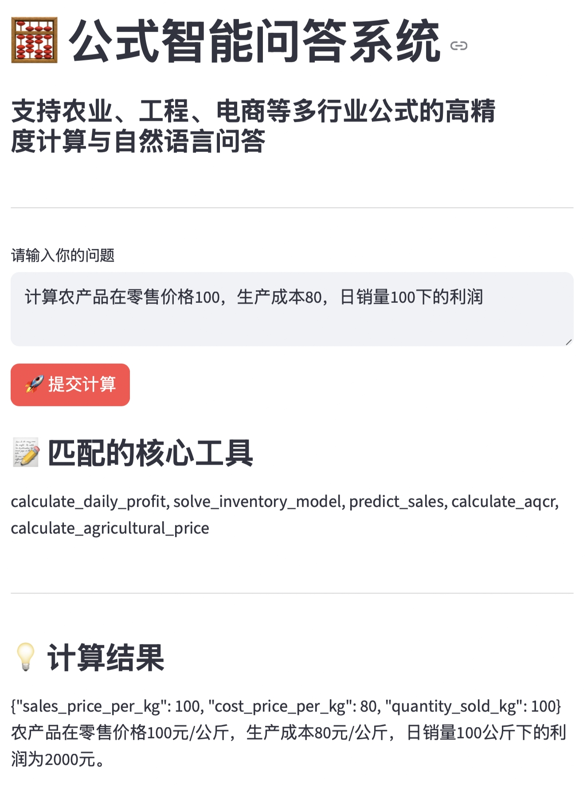

# 公式智能问答系统

## 项目概述

本项目是一套基于 **FastAPI + Streamlit + AI Agent + MCP** ，整合 TF-IDF 文本匹配、通义千问大模型与多行业公式工具，支持农业、工程、电商、化工等领域的公式计算与自然语言问答，提供可视化前端交互界面，操作简单、计算精准。

- 核心计算逻辑通过专业数学库（SymPy/NumPy/Math）封装为 MCP 服务，保证计算精度与可控性

## 项目结构

```
07-document-formual-qa/
├── mcp_server.py                 # MCP 服务端（计算引擎）
├── mcp_rag_client.py             # RAG + LLM 客户端（智能问答核心）
├── streamlit_demo.py             # 提供 Web 交互页面
└── README.md                     # 项目说明
```

为了方便测试，```mcp_server.py``` 中注册了 20 个覆盖农业、工程、电商、医疗等多行业的高精度公式工具。

## 核心流程

### 1. 服务启动

#### 步骤 1：启动 MCP 工具服务端

运行

```
python mcp_server.py
```

终端显示服务监听在 8900 端口

#### 步骤 2：启动后端 API 服务

运行

```
python mcp_rag_client.py
```

#### 步骤 3：启动 Streamlit 前端界面

运行

```
streamlit run streamlit_demo.py
```

打开浏览器访问 `http://localhost:8501`，进入智能问答界面

## 2. 业务流程

用户提问 → 前端发起请求 → 后端获取工具列表 → TF-IDF 工具匹配 → 调用大模型生成回答 → 结果返回给前端 → 结果展示

## 结果展示


