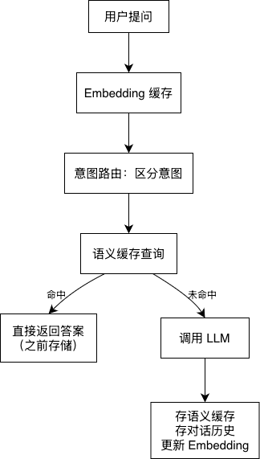

# AI 向量检索与智能缓存服务

## 项目概述

这是一个基于 **向量嵌入 + Redis 缓存 + Faiss 语义检索** 构建的 AI 中台服务，核心解决重复调用大模型、重复计算向量等问题。

封装了 **语义缓存、意图路由、对话历史管理、向量缓存** 四大核心能力，并通过 FastAPI 提供标准化 HTTP 接口。

### 核心价值

- 基于向量相似度的智能路由，精准识别用户意图并分流到对应业务逻辑
- 支持按语义相似度检索对话历史，实现上下文感知的智能问答
- 所有模块共用嵌入模型和缓存逻辑，避免重复开发

## 项目结构

```
08-llm-smart-cache/
├── llm_cache/                    # 核心功能模块
│   ├── EmbeddingsCache.py         # 嵌入向量缓存
│   ├── SemanticCache.py           # 语义缓存
│   ├── SemanticMessageHistory.py  # 对话历史管理
│   └── SemanticRouter.py          # 语义路由
├── config.py                     # 配置文件
├── main.py                       # 主程序
├── benchmark.py                  # 多场景压测
└── README.md                     # 项目说明文档
```

#### 核心功能模块

|          模块          |             功能             |               解决的问题                |
| :--------------------: | :--------------------------: | :-------------------------------------: |
|    EmbeddingsCache     |      文本的嵌入向量缓存      |  避免重复计算 embedding，加速向量生成   |
|     SemanticCache      |  匹配相似问题，返回历史回答  | 相同/相似问题直接返回答案，不重复调 LLM |
| SemanticMessageHistory | 管理对话上下文，检索历史消息 |     支持连续对话，自动保留最近 K 条     |
|     SemanticRouter     |    基于语义的用户意图分类    |            自动识别用户意图             |

## 核心流程

### 1. 服务启动

运行

```
python main.py
```

启动服务后，访问 `http://localhost:8000/docs` 可查看自动生成的 Swagger 接口文档，支持在线调试。

### 2. 业务流程



## 接口说明

| 方法 | 路径                      | 说明                          |
| ---- | ------------------------- | ----------------------------- |
| POST | `/chat`                   | 主对话接口                    |
| POST | `/router/add`             | 添加意图路由规则              |
| POST | `/cache/delete`           | 删除指定文本的 embedding 缓存 |
| POST | `/cache/clear`            | 清空所有缓存                  |
| GET  | `/history/{session_id}`   | 查询对话历史                  |
| GET  | `/history/sessions`       | 列出所有有历史记录的会话      |
| POST | `/history/search/keyword` | 关键词搜索历史                |
| POST | `/history/clear`          | 清空指定会话历史              |

## 性能测试

### 测试方法 

使用 `benchmark.py` 进行多场景压测，并发50。

### 测试结果 

| 场景               | QPS      | 平均延迟 | 缓存命中率 | 路由命中率 |
| ------------------ | -------- | -------- | ---------- | ---------- |
| 100%缓存命中       | **1653** | **29ms** | 100%       | 100%       |
| 70%缓存命中        | 7        | 2.7s     | 81%        | 81%        |
| 50%缓存命中        | 6        | 3.6s     | 83%        | 48%        |
| 0%缓存命中(冷启动) | 2        | 8s       | 0%         | 0%         |

### 关键结论

**缓存命中 vs 未命中性能对比**： 

- QPS提升：**800倍**（1653 vs 2） 
- 延迟降低：**300倍**（29ms vs 8s） 

**实际业务测算**（日均10万请求，70%缓存命中率）： 

- 节省LLM调用：7万次/天 
- 月节省成本：**约¥21万元**
