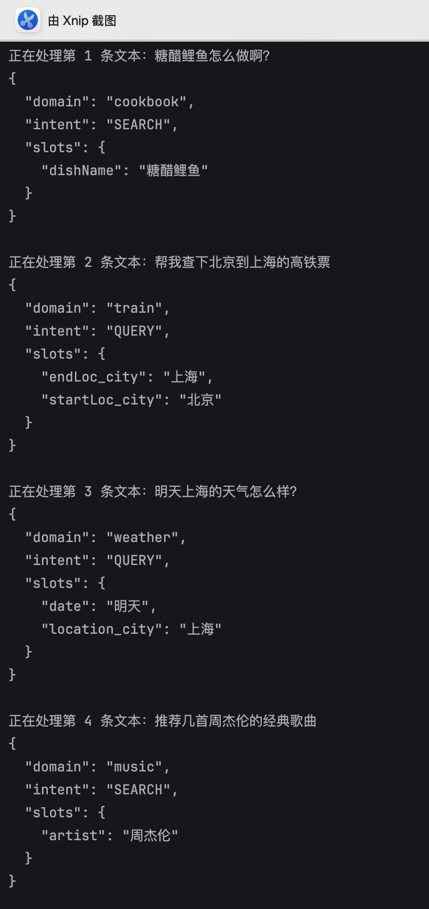
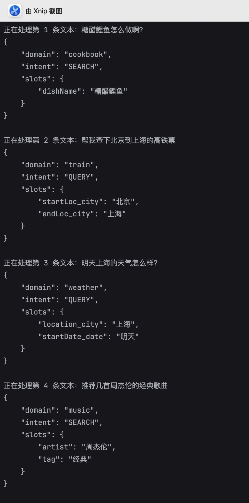

## 信息抽取智能体服务 

基于 FastAPI + 通义千问 API 实现的文本信息抽取服务，支持「领域识别、意图识别、实体抽取」三大核心功能，提供两种抽取方案（function call + 提示词）。 

### 核心功能

- 两种抽取方案：

  - function call：强格式约束，结果规范，适合对数据格式要求严格的场景；

    接口地址：POST /extract/function-call

  - 提示词：灵活度高，快速迭代，适合新增字段无需修改代码结构的场景

    接口地址：POST /extract/prompt

- 返回领域（domain）、意图（intent）、实体（slots），按照以下格式输出：

```
  {
      "domain": ,
      "intent": ,
      "slots": {
        "待选实体": "实体名词",
      }
  }
```

### 核心模块说明：

- `ExtractionRequest`：请求模型（接收用户输入文本、模型名称）；
- `ExtractionResponse`：响应模型（统一返回结构化抽取结果）；
- `IntentDomainNerTask`：函数调用的结构化模型（强约束领域、意图、实体字段）；
- `ExtractionAgent`：函数调用代理类（封装大模型工具调用逻辑）；
- API 路由： `/extract/function-call`（函数调用）、`/extract/prompt-engineering`（Prompt 工程）。

### 测试结果

function call 结果：  
  
提示词结果：  
  

从两个方法的结果可以看出，能够准确的抽取出**领域识别**、**意图识别**和**实体标签**，两种方法泛化能力都较强。
