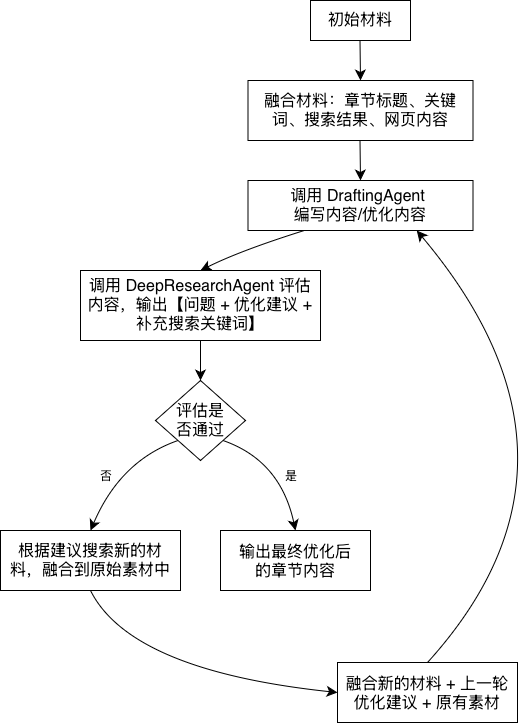

## Agentic AI 深度研究生成系统

### 项目概述

本项目是一个基于 ReAct（Reasoning + Acting）范式的 AI 深度研究内容生成系统，核心功能是针对指定研究主题自动拆分章节、批量检索素材、并通过多轮迭代优化生成高质量的结构化研究内容。

系统通过 **DraftingAgent + DeepResearchAgent** 的分工协作，结合 Jina AI 搜索接口获取的全网素材，实现迭代，最终输出比单次生成更优质的研究内容。

### 流程说明

### 功能

- **ReAct 迭代优化**：基于「推理 - 行动」范式，对单章节内容进行多轮「生成→评估→优化」，而非一次性生成内容；

- **两个智能体分工**：
  - DraftingAgent：专门撰写章节内容，仅负责根据素材 + 优化建议生成文本；
  - DeepResearchAgent：专门评审内容，仅负责评估质量、提出修改意见、补充搜索关键词；

- **结构化输出**：最终输出按章节拆分的完整研究内容，包含标题、正文、案例、参考文献等要素；

### 结果展示

- 生成完整报告见：agentic_ai_research_report.md

- 生成及迭代过程如下：

  
