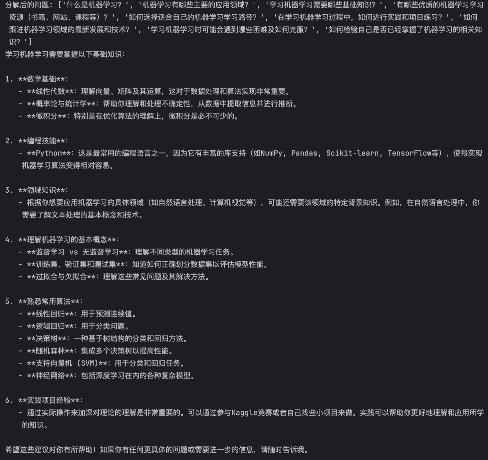

## searchRAG 

基于 **RAG（检索增强生成）+ 多智能体（Multi-Agent）** 构建的实时问答系统，通过调用谷歌搜索（Jina 接口）增强大模型的实时信息能力，解决大模型“知识过时、事实性错误”的问题。 

#### 关键模块

- **多个智能体分工**：
  - 思考代理：将复杂问题拆分为子问题，降低检索的难度
  -  搜索代理：调用 **search_jina** 工具，并发检索每个子问题
  - 总结代理：整合原始问题和搜索结果，生成准确、简洁的回答
- **异步并发**：基于 `asyncio` 实现多子问题并发搜索，大幅提升检索效率； 

#### 运行结果

