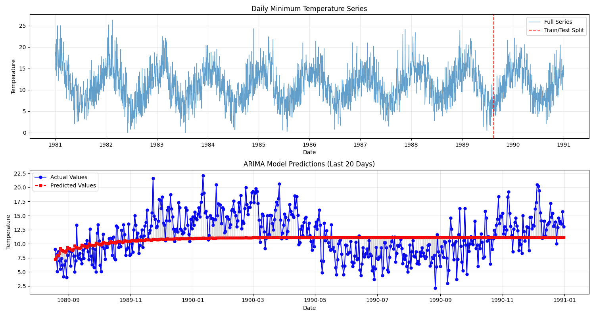
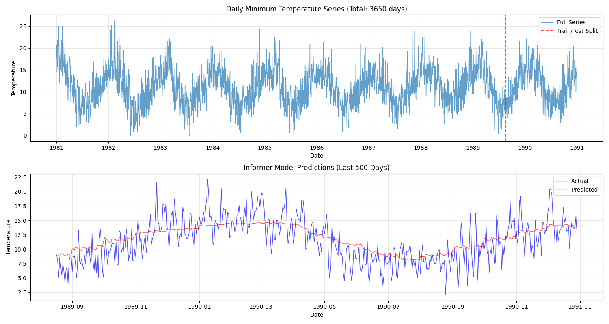

## 日最低气温预测 - 三种时序模型对比

### 实验概述

针对澳大利亚日最低气温数据集，分别采用**传统统计模型（SARIMA）**、**工业级时序模型（NeuralProphet）**、**深度学习长序列模型（Informer）** 完成未来 500 天的气温预测任务，对比不同模型在长时序预测场景下的性能表现。

#### 核心评价指标

- 均方误差（MSE）
- 均方根误差（RMSE）
- 平均绝对误差（MAE）
- 平均绝对百分比误差（MAPE）

### 实验结果

|   模型   |   MSE   |  RMSE  |  MAE   |  MAPE  |
| :------: | :-----: | :----: | :----: | :----: |
|  SARIMA  | 13.6591 | 3.6958 | 3.0127 | 30.78% |
| Prophet  | 6.8001  | 2.6077 | 2.0717 | 23.12% |
| Informer | 7.0898  | 2.6627 | 2.0924 | 23.45% |

SARIMA 模型：

基于 ARIMA 框架增加季节性处理，假设数据符合线性平稳规律，通过拟合历史数据的自相关、移动平均特性实现预测

Prophet 模型：

基于加法模型（趋势 + 季节 + 节假日），专为商业场景的时序预测设计，天然适配强周期、带趋势的日度数据。

Informer 模型：

基于 Transformer 架构的长序列预测模型。

### 模型对比分析

- **Prophet 表现最优**：RMSE 2.6077，MAPE 23.12%，适配强周期日度数据的工业级优势显著
- **Informer 接近 Prophet**：RMSE 2.6627，作为简化版深度学习模型，一次性预测 500 天仍达到工业级水平
- **SARIMA 效果明显较差**：线性模型无法捕捉气温的非线性季节规律，长预测误差快速累积
