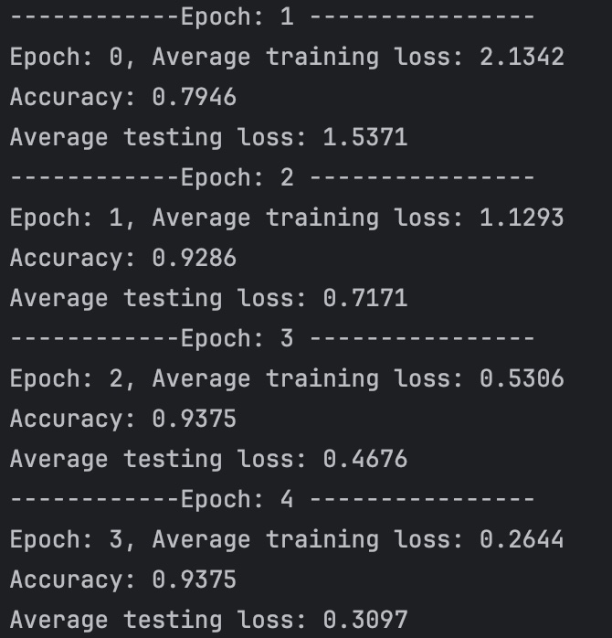
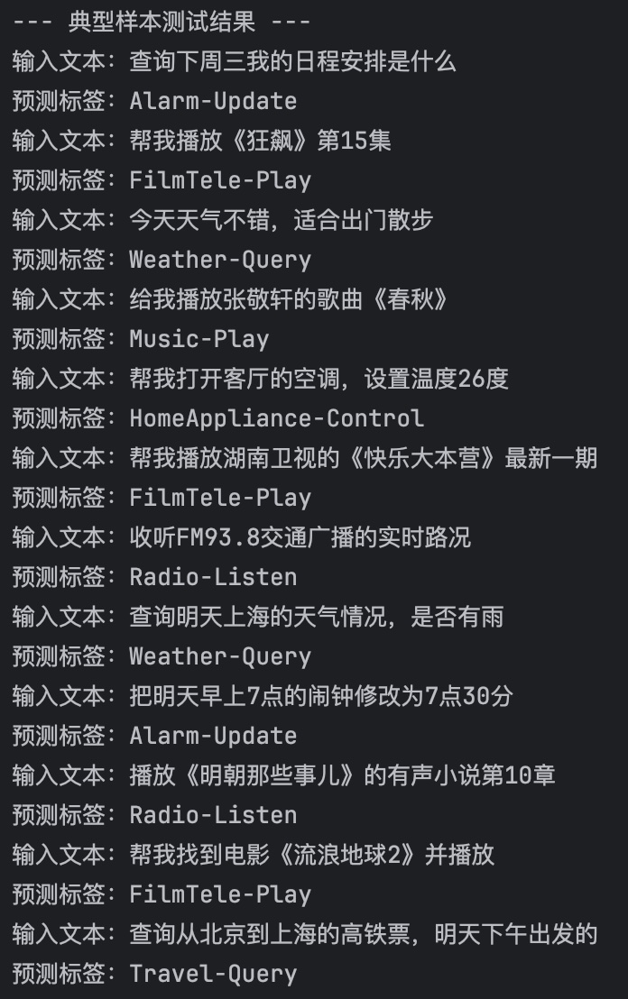
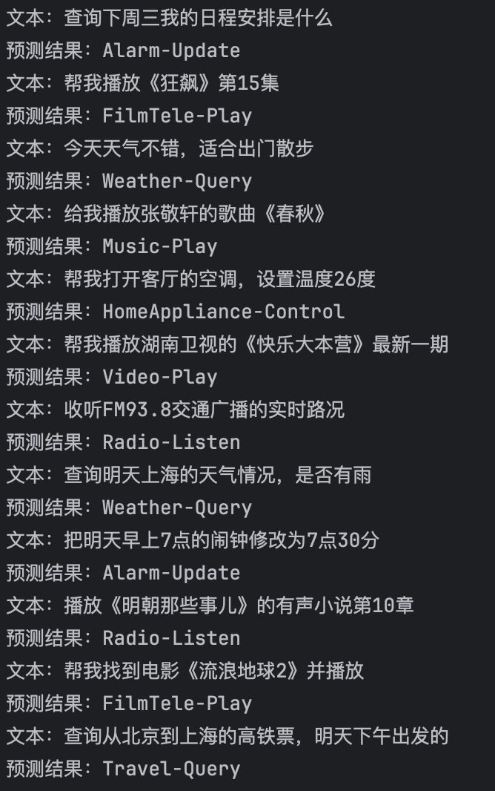

本项目实现了基于 BERT-base-chinese 的文本分类任务，提供两种实现方式：手动编写训练循环 & Hugging Face Trainer 封装，便于对比学习且效果稳定。

## 代码实现方式对比
### 方式1：手动编写训练&验证循环（bert_text_classification.py）
#### 核心特点
1.  纯 PyTorch 实现，手动编写 `train()`、`validation()` 函数，掌控训练全流程；
2.  手动实现「梯度清零→前向传播→损失计算→反向传播→梯度裁剪→参数更新」；
3.  手动编写 `flat_accuracy()` 函数计算评估准确率；

### 方式2：Hugging Face Trainer 封装（bert_text_classification_trainer.py）
#### 核心特点
1.  基于 Hugging Face `transformers` 库的 `Trainer` 类，无需手动编写训练循环；
2.  内置封装「梯度计算、权重更新、日志记录、模型保存」等功能，无需关注底层细节；
3.  通过 `compute_metrics()` 回调函数自定义评估指标（准确率）；

## 模型训练说明
- 训练轮次（Epoch）：4 轮
- 优化器：AdamW（学习率 2e-5）
- 最大文本长度：64 Token
- 批次大小（Batch Size）：16
- 训练设备：自动选择（MPS / CUDA / CPU）
- 训练过程：损失值逐步下降，验证准确率逐步提升，模型收敛稳定
- 方法一训练结果如下：

- 方法二训练结果如下：
## 模型训练评估结果
| Epoch | eval_loss | eval_accuracy | eval_runtime (s) | eval_samples_per_second | eval_steps_per_second |
|-------|-----------|---------------|------------------|------------------------|----------------------|
| 1.0   | 1.7858    | 0.68          | 0.6599           | 151.538                | 10.608               |
| 2.0   | 1.1662    | 0.93          | 0.2615           | 382.459                | 26.772               |
| 3.0   | 0.8306    | 0.93          | 0.2615           | 382.421                | 26.769               |
| 4.0   | 0.7226    | 0.95          | 0.2123           | 471.085                | 32.976               |

### 结果分析
1.  **模型收敛趋势明显**：随着训练轮次增加，`eval_loss` 从 1.7858 持续下降至 0.7226，说明模型的预测误差不断减小。
2.  **准确率快速提升并稳定**：`eval_accuracy` 从第 1 轮的 0.68 提升至第 2 轮的 0.93，后续保持稳定，最终在第 4 轮达到 0.95，模型泛化能力良好。
3.  **评估效率逐步提高**：`eval_runtime` 逐渐缩短，`eval_samples_per_second` 和 `eval_steps_per_second` 持续提升，说明模型在训练过程中没有出现效率下降的问题。

## 模型测试效果
对 12 个类别各 1 条典型样本进行测试，方法一测试结果如下：

方法二测试结果如下：

