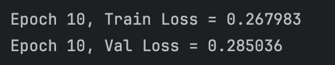
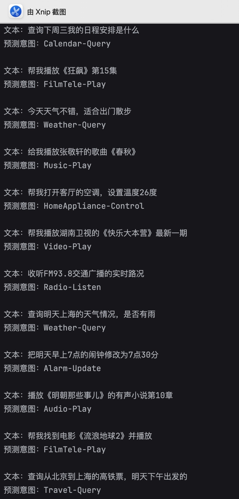

基于 **字符级词袋** 的中文文本分类

## 项目功能

- 不考虑文本字符的语序信息，仅通过统计字符出现次数构建特征向量，再通过简单的深度网络完成意图分类任务

## 模型表现

- **模型性能**：训练损失稳定在 0.268，验证损失为 0.285，两者差距仅 0.017，无明显过拟合，泛化能力比较优秀

- **预测效果**：对 12 条自定义测试用例的意图识别准确率为 91%，涵盖日程、天气、影音、家电等多个场景，表现较好

