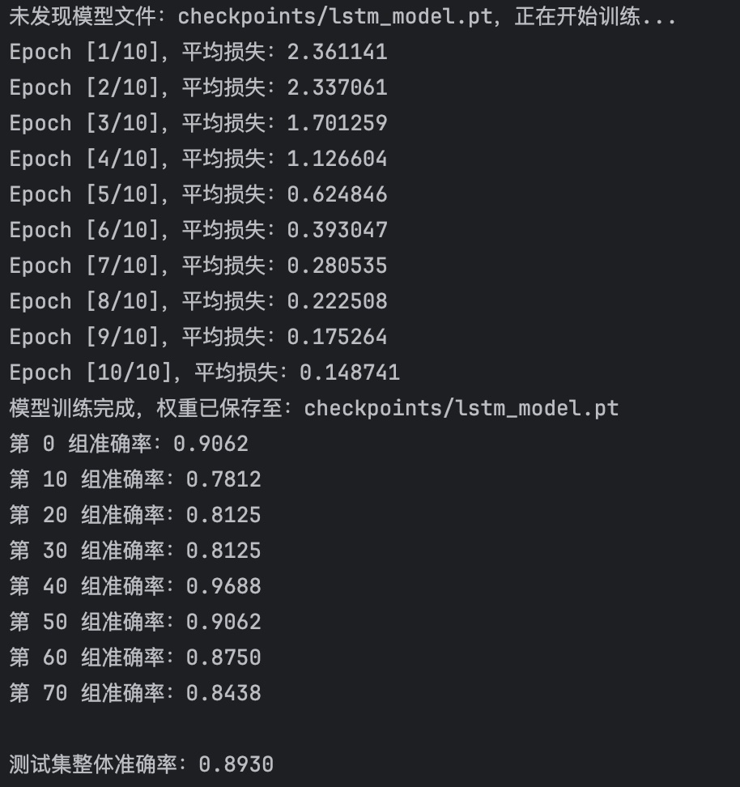
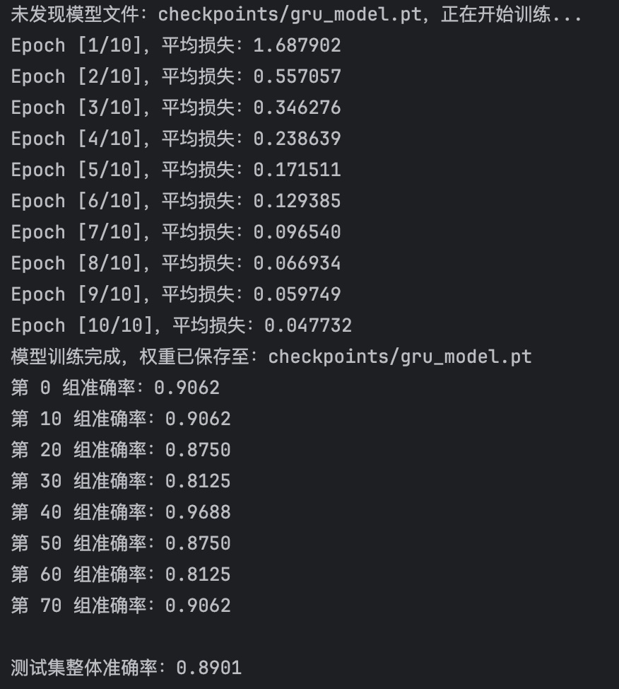
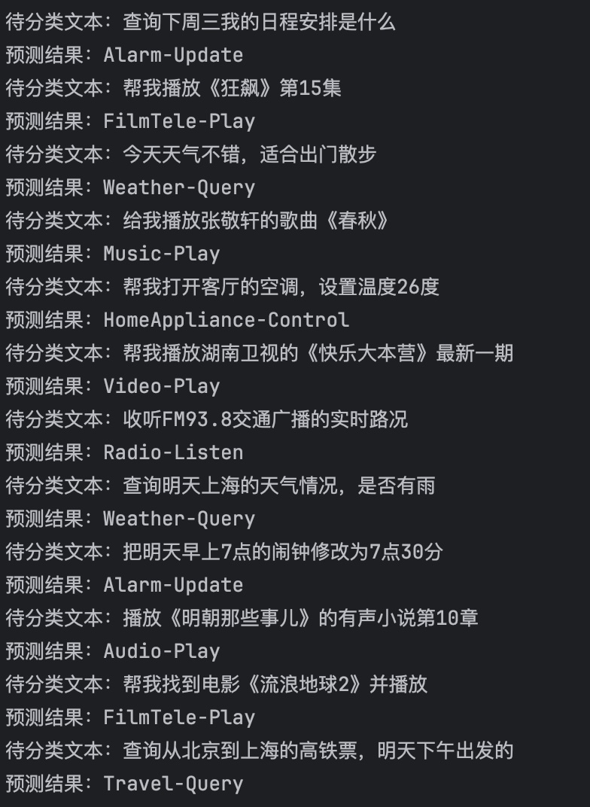
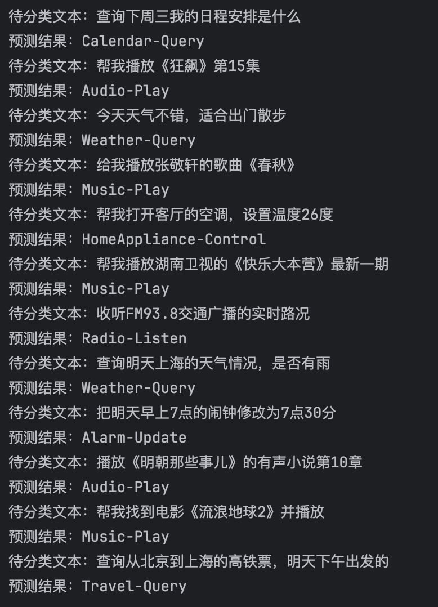

基于循环网络模型 LSTM/GRU 进行文本意图分类

## 项目功能

- 同时实现 **LSTM** 和 **GRU** 两种核心序列模型，用于完成中文短文本意图分类任务。模型能够准确识别用户文本中的核心意图，两种模型泛化能力均比较稳定，两者均具备实用落地价值。

## 模型表现

- **模型性能**：LSTM模型训练损失稳定在 0.14，验证准确率为 0.89；GRU模型训练损失稳定在0.04，验证准确率为0.89，无明显过拟合，泛化能力比较优秀
LSTM 测试结果如下：  
  
GRU 测试结果如下：

- **预测效果**：对 12 条自定义测试用例的意图识别准确率为 91%，涵盖日程、天气、影音、家电等多个场景，表现较好
LSTM 预测结果如下：  
  
GRU 预测结果如下：

