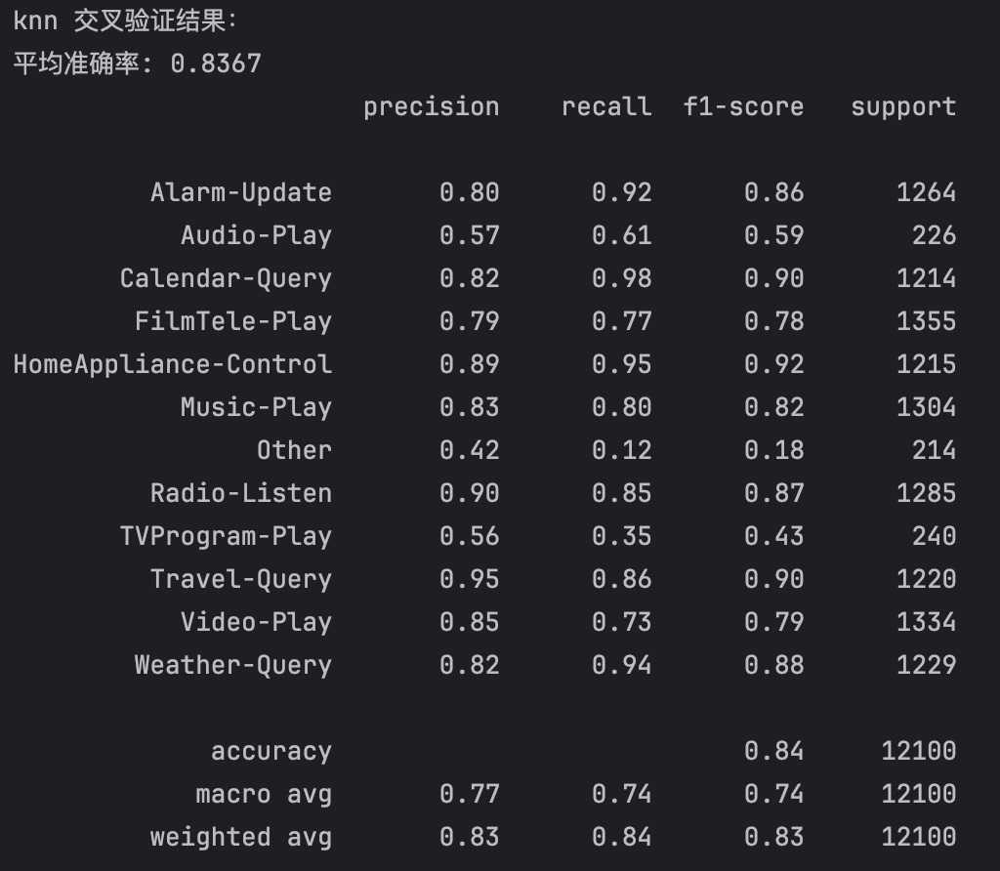
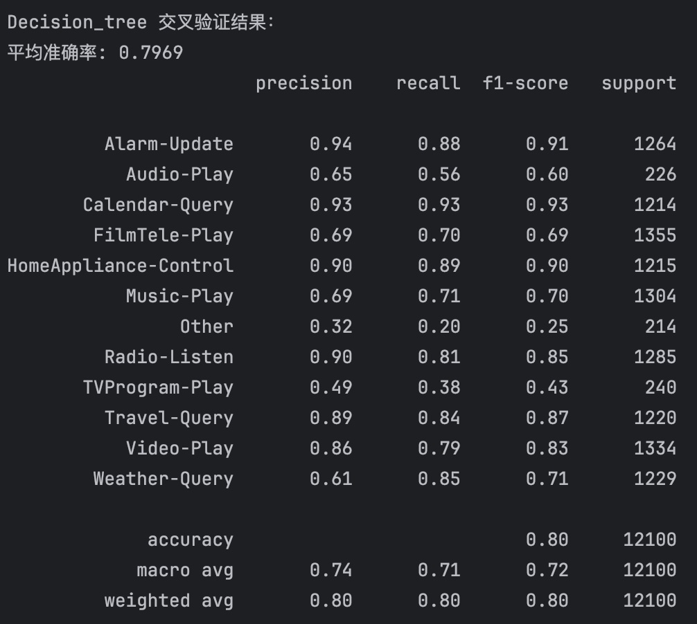
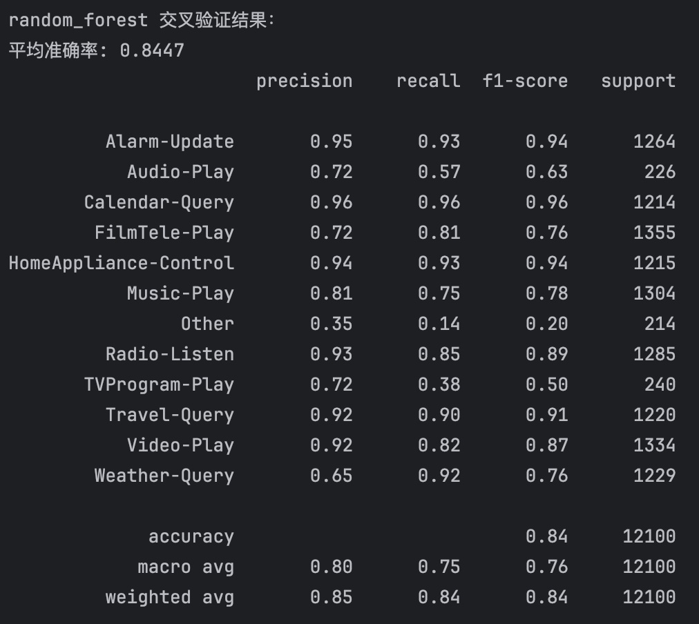
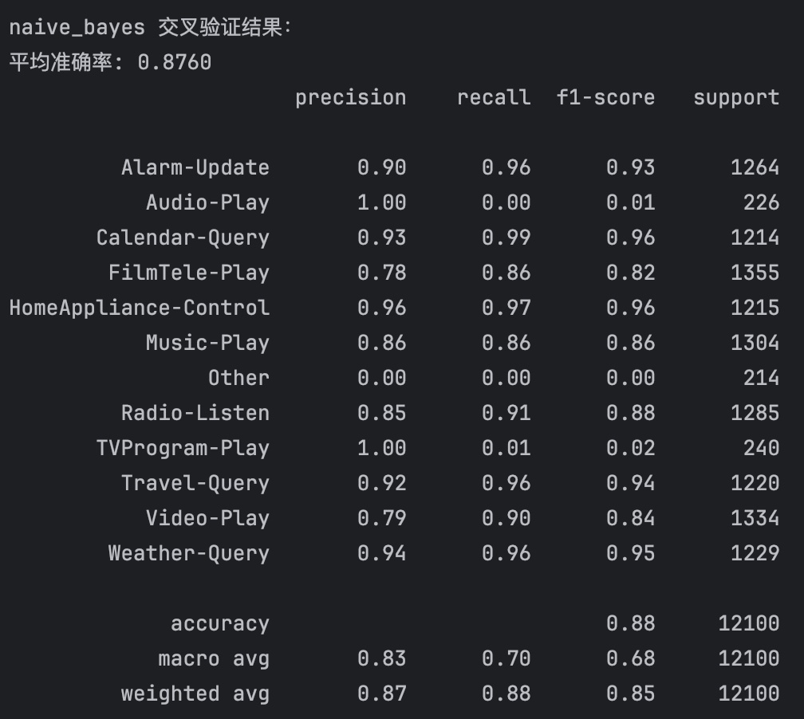
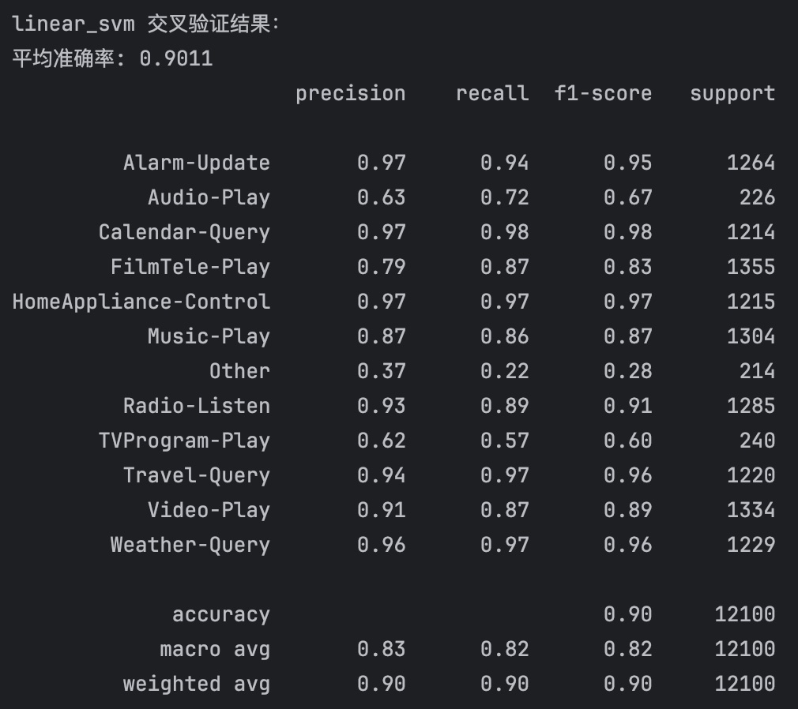
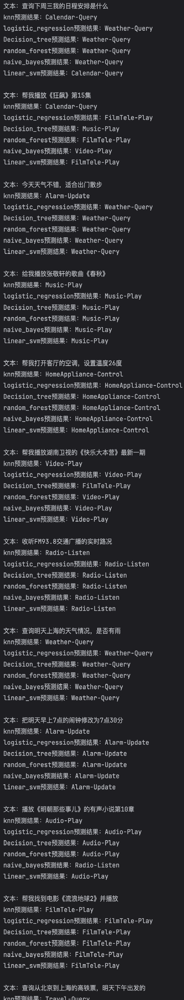

基于机器学习的中文文本多分类任务，以智能指令分类为场景，对比 6 种经典分类模型的性能。

## 项目功能

- 中文文本分词与TF-IDF特征提取
- 6种模型交叉验证性能评估（KNN、决策树、逻辑回归、随机森林、朴素贝叶斯、支持向量机）

## 模型表现

Linear SVM 模型表现最优，整体准确率达 90.11%；决策树模型表现相对较差，准确率为 79.69%。

具体表现如下：

- KNN

- 决策树

- 随机森林

- 朴素贝叶斯

- 支持向量机

## 测试结果
用12类文本进行测试，对比6种模型识别结果，测试结果如下：

