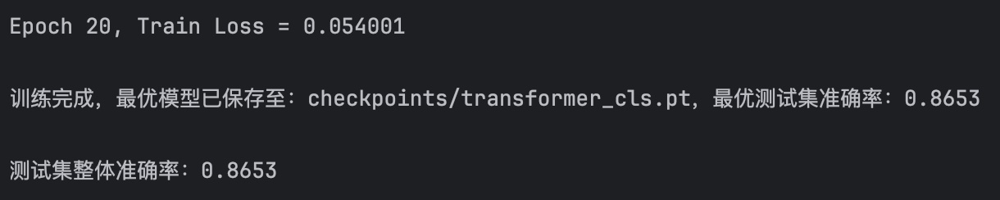
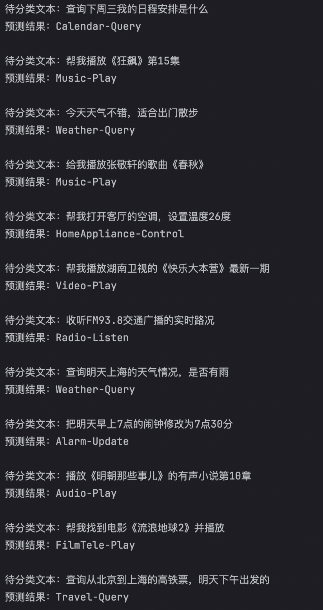

基于 Transformer 的文本意图分类模型

## 项目功能 

1. 基于 jieba 实现中文文本分词与词汇表构建； 
2. 实现 Transformer 编码器的文本特征提取；
3. 在训练过程中自动保存测试集最优准确率模型（将整个数据集分成 80% 训练集，20% 测试集）； 
4. 提供了单条文本预测接口，支持批量测试用例验证。 

## 模型效果

- 训练结果
训练损失稳定下降，测试集最优准确率达到了 **86.53%**，模型泛化能力良好  
  
- 测试结果  
对常见用户意图的分类效果：  
 
